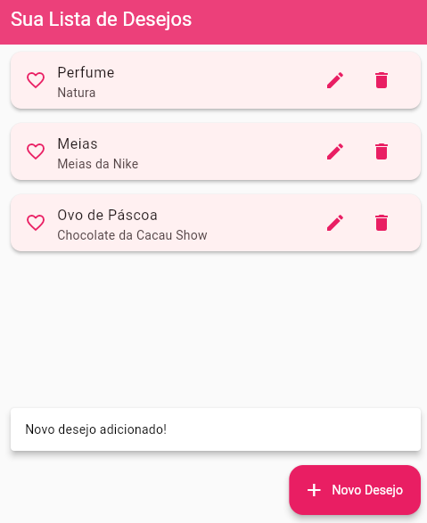
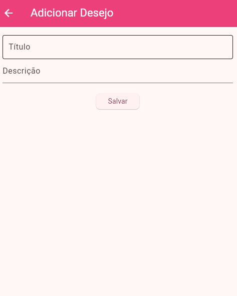

# 🎁 Wishlist App - Flutter Web

Uma aplicação web desenvolvida com **Flutter** para gerenciar sua lista de desejos. Este projeto foi criado como **atividade avaliativa da disciplina de Desenvolvimento para Dispositivos Móveis II**, no curso de Análise e Desenvolvimento de Sistemas.

---

## ✨ Funcionalidades

- ✅ Adicionar itens à lista de desejos  
- 📝 Editar itens existentes  
- ❌ Remover itens da lista  
- 💾 Salvamento local com `shared_preferences`  
- 💬 Toasts (mensagens) para ações realizadas  
- 🎨 Interface moderna, clean e responsiva  
- 📱 Compatível com Web

---

## 📸 Imagens do App

### 📥 Tela de boas-vindas


### 🧾 Lista de desejos


### ➕ Adicionando um novo desejo


---

## 🚀 Como rodar o projeto

1. Clone o repositório:
```bash
git clone https://github.com/seu-usuario/seu-repositorio.git
cd seu-repositorio


2. Instale as dependências:
flutter pub get

3. Execute o app no navegador:
flutter run -d chrome


## 🛠️ Tecnologias utilizadas

- **Flutter 3.24.3**
- **Dart**
- `shared_preferences`
- Material Design 3


